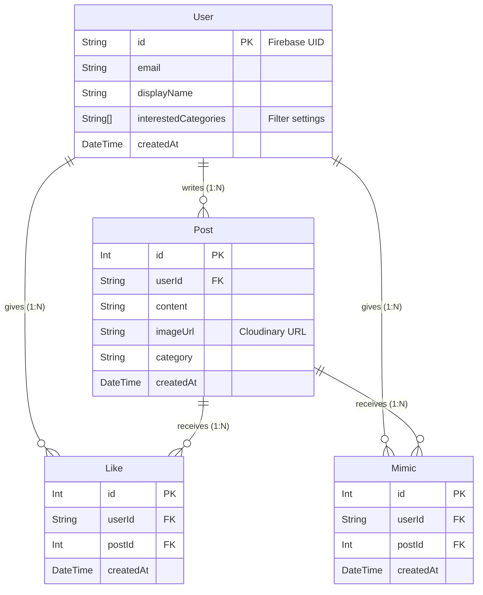
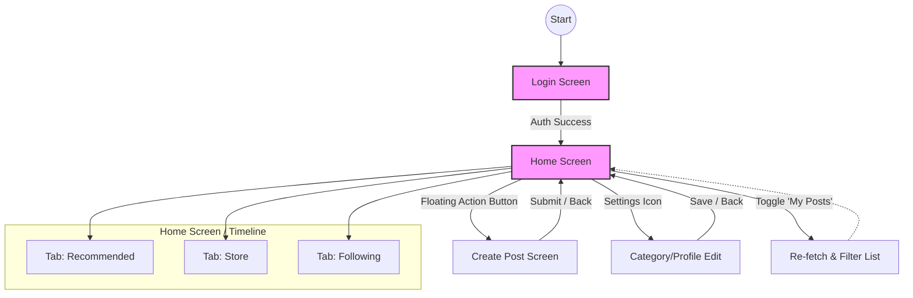

# Toragram (仮) - 店舗応援・ナレッジ共有プラットフォーム

店舗スタッフ間での売り場作りの成功事例や、日々の業務・ナレッジを共有するためのSNSアプリケーションです。「良い売り場を真似する（横展開する）」文化の醸成を目的としています。


## 📖 プロジェクト概要

### 目的
* 店舗応援期間中における売り場陳列の成功事例共有
* 従業員間のコミュニケーション活性化
* 「いいね」や「真似したい」によるモチベーション向上とナレッジ蓄積

### システム構成
* **Frontend:** Flutter (Web)
* **Backend:** Node.js (Express) + TypeScript
* **Database:** PostgreSQL (via Prisma ORM)
* **Auth:** Firebase Authentication
* **Storage:** Cloudinary (画像ホスティング)
* **Infra:** Render (Web Service + PostgreSQL)

---

## 🛠 機能要件 (Functional Requirements)

### 1. ユーザー認証・設定
* **ログイン:** Firebase Authを使用したメール/パスワード認証
* **プロフィール:** 表示名、興味のあるカテゴリー（フィルタリング用）の設定
* **設定保存:** 自分の投稿の表示/非表示設定（端末ローカル保存 / Shared Preferences）

### 2. タイムライン表示
* **タブ切り替え:**
    * **おすすめ:** 全投稿、または興味のあるカテゴリーに基づく投稿
    * **店舗:** 店舗に関する投稿のみをフィルタリング
    * **フォロー中:** フォローユーザーの投稿（未読バッジ機能付き）
* **カード表示:** 投稿画像、投稿者情報、本文、リアクション数

### 3. 投稿機能
* **メディア:** 画像アップロード（Cloudinary連携）
* **情報入力:** テキスト本文、カテゴリー選択（グロサリー、飲料、日配など）
* **UI/UX:** キーボード表示時のレイアウト調整、レスポンシブ対応

### 4. リアクション・評価システム
* **いいね (Like):** 共感の意思表示
* **真似したい (Mimic):** 「自店でも実施したい」という意思表示（ランキングの重要指標）

### 5. ランキング機能
* **集計期間:** 週間 / 月間
* **表示:** 上位3位へのバッジ表示、人気投稿の可視化

---

## 🏗 システムアーキテクチャ & 設計

### ディレクトリ構成 (Monorepo構成)

```text
/
├── backend/          # Node.js + Express + Prisma
│   ├── prisma/       # DB Schema (schema.prisma)
│   ├── src/
│   │   ├── controllers/
│   │   ├── routes/
│   │   └── services/
│   └── ...
│
└── frontend/         # Flutter Web App
    ├── lib/
    │   ├── models/
    │   ├── screens/
    │   ├── services/ # API Connect
    │   └── widgets/
    └── ...
```
### ER図


### 画面遷移図

